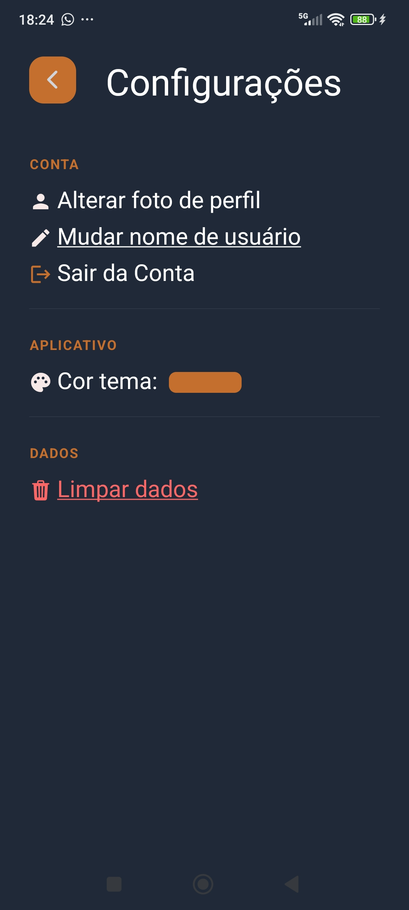

## Assistidos

Aplicativo  Assistidos criado para a matéria de Sistemas Móveis do Unileste, curso de Sistemas da Informação, 01/26

## Objetivo:

O objetivo desse aplicativo é permitir que o usuário registre e acompanhe mídias que já foram assistidas, como filmes, séries ou animes. A ideia é ajudar a manter um histórico pessoal de consumo de mídia de forma simples e rápida, sem exigir informações excessivamente detalhadas, deixando o usuário livre para organizar seus registros da maneira que preferir quando quiser.

## Tecnologias usadas:

Foram usadas as seguintes tecnologias e ferramentas na criação desse aplicativo:

### Frontend:
- React Native
- Expo
- Expo Go
- TypeScript
- React Navigation
- AsyncStorage
- Expo Vector Icons

### Backend:
- Node.js
- Express
- TypeORM
- SQLite3
- JWT

## Screenshots Tela Usuário Comum:

|  |  |  |  |  |     |
| ------------- | ------------- | ------------- | ------------- | ------------- | --- |


## Contas Usadas para Testes: 

### SuperAdmin:
- e-mail: admin@gmail.com
- senha: 123456

### Usuário Comuns:
- e-mail: marvel@gmail.com / senha: 123456
- e-mail: duda@gmail.com / senha: 123456
- e-mail: levi@gmail.com / senha: 123456

## Modo de Usar: 
Abra o terminal e execute o seguinte código para clonar o repositorio:
```
git clone https://github.com/Neves004/AssistidosApp.git 
```

Depois, entre na pasta usando o comando:

```
cd filmes
```

Depois instale as dependências
```
npm install
```


Vá até o arquivo SRC/api/assistidos.ts    
No campo de const ASSISTIDOS_API = base_url, adicione o seu IP após os dois pontos.      
Caso não saiba pesquise como fazer em seu dispositivo.       
(Dica: Ao rodar usando o expo, abaixo do qr-code o metro te mostrará seu ip)

### Rodando o Backend:
Agora em outro terminal vá até o Backend

```
cd backend/
```


```
cd assistidos-backend/
```


E dê o comando para o iniciar:

```
npm run start
```

### Abrindo com Expo Go:

Depois, certifique-se de ter instalado o Expo Go no seu celular. Após isso, pode executar o aplicativo no terminal inicial, usando o comando:
```
npm run start
```

### Abrindo com o Emulador do Android Studio:

Depois, certifique-se de ter o Android Studio e um emulador criado. Após isso, pode executar o aplicativo no terminal inicial, usando o comando:

```
npx expo run:android
```